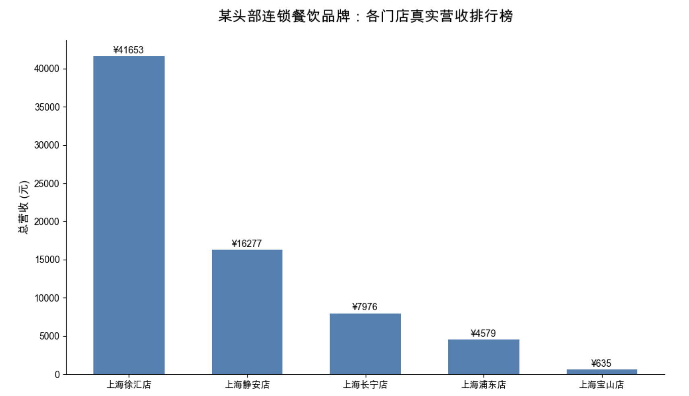

# 🚀 零售多门店自动化核销数据管道 (Retail Auto ETL Pipeline)

## 📊 业务背景 (Business Context)
在操盘某头部线下连锁餐饮品牌（AM餐饮）时发现，业务团队每天需耗费大量时间（约1-2小时）手动从各门店终端下载表格、合并核销流水，并人工排查异常退款订单。
不仅人工成本极高、易出错，且导致管理层无法实时观测各大区真实的 ROI 与门店梯队落差。

## 🎯 解决方案 (The Solution)
本项目搭建了一套基于 Python/Pandas 的轻量级自动化 ETL 数据管道，实现从“底层脏活”到“决策层看板”的秒级转化：
1. **测试数据生成 (`mock_data_generator.py`)：** 自动模拟生成具有真实商业梯度（如店王 vs 尾部门店）的测试数据集，并按比例注入“已退款”等脏数据。
2. **自动化清洗与合并 (`retail_etl_pipeline.py`)：** 绝对路径扫描，一键读取多门店源数据，执行严格的业务过滤规则（精准剔除未核销/退款干扰项），提纯有效结算流水。
3. **商业智能可视化 (`data_visualization.py`)：** 利用 Matplotlib 模块，终端一键输出大盘营收排行榜。

## 💡 业务收益 (Business Impact)
- **极速增效：** 将原本需要 120 分钟的人工合并清洗流程，压缩至 **0.1 秒** 自动化执行。
- **决策赋能：** 输出极其干净的多维战报，助力业务端一秒定位异常门店梯队，为后续资源倾斜与干预策略提供数字弹药。

## 📈 核心战果展示 (Visualization)
*(展示自动化生成的各门店真实核销营收排行榜)*

## 🛠️ 技术栈 (Tech Stack)
`Python 3.x`, `Pandas` (数据清洗/ETL), `Matplotlib` (数据可视化), `OS` (批处理引擎)
